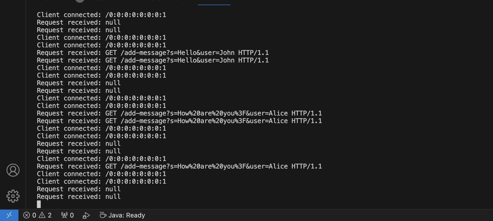
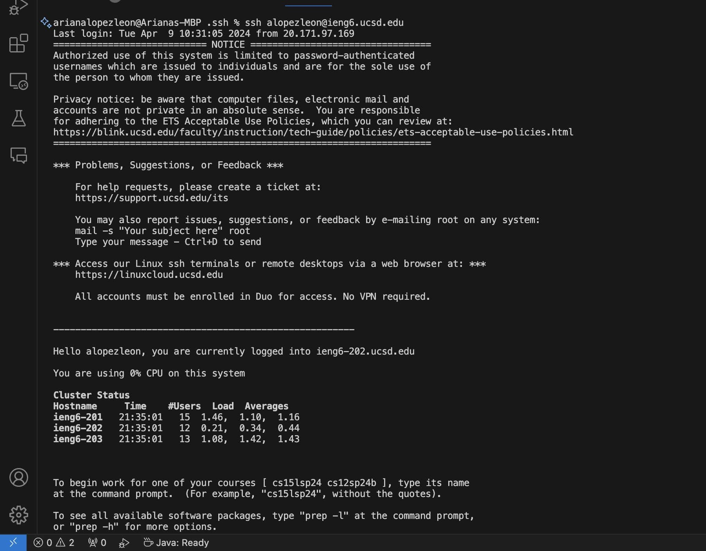
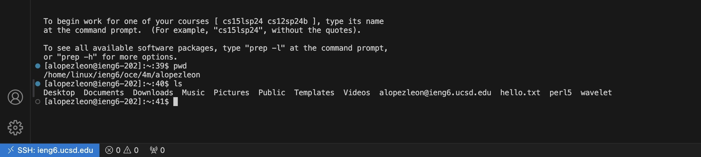

* The methods that are called in my code are the ```main``` method and the ``handleClient`` method. The ``main`` method makes the server listen for incoming connections. While the ```handleClient``` method reads the request from the client, gets the content of the message, and username, and sends the updated chat history as a response. The relevant arguments is the GET request to the ```/add-message``` endpoint with the parameters ```s=hello``` , ```user=John``` and ```s=How%20are%20you%3F``` , ```user=Alice```.


